#+TITLE: Manuel utilisateur de CSRS Report
#+SUBTITLE: Tâches, suivi hiérarchique et agendas de direction
#+AUTHOR: CSRS
#+DATE:
#+LANGUAGE: fr
#+OPTIONS: toc:3 num:t ^:nil
#+LATEX_CLASS: article
#+LATEX_CLASS_OPTIONS: [11pt,a4paper]
#+LATEX_HEADER: \usepackage[margin=18mm]{geometry}
#+LATEX_HEADER: \usepackage{float}
#+LATEX_HEADER: \setlength{\parindent}{0pt}
#+LATEX_HEADER: \setlength{\parskip}{0.6em}
#+STARTUP: overview

* À propos de ce manuel

CSRS Report permet de créer et attribuer des tâches, suivre leur progression réelle, échanger des observations, valider le travail terminé et préparer les agendas de la Direction des programmes et de la Direction administrative. Le présent manuel décrit l'interface React disponible sous =/app/= et réserve l'administration technique à une annexe.

Les écrans visibles dépendent de la position hiérarchique et des délégations actives. L'absence d'un menu signifie généralement que le compte ne possède pas cette responsabilité; elle ne doit pas être contournée en utilisant le compte d'une autre personne.

Les exemples reposent exclusivement sur des comptes et données fictifs. Les mots de passe ne sont jamais reproduits dans ce document.

** Trois profils de référence

#+ATTR_LATEX: :align p{0.18\linewidth}p{0.12\linewidth}p{0.20\linewidth}p{0.42\linewidth}
| Profil | Compte fictif | Position illustrée | Parcours principal |
|--------+----------------+---------------------+--------------------|
| Collaborateur sans subordonné | =atall= | Feuille de l'organigramme | Consulter ses tâches, saisir une progression, publier une observation et proposer une tâche |
| Responsable intermédiaire | =daf= | Direction avec collaborateurs | Réaliser les opérations personnelles, attribuer une tâche, consulter l'équipe et prendre les décisions du responsable |
| Direction générale | =dg= | Sommet de l'organigramme | Superviser le périmètre global, s'attribuer une tâche, valider explicitement ses tâches personnelles et consulter les agendas archivés |

Les rôles fonctionnels =secretariat_dg=, =rh= et =dev= sont décrits dans les annexes parce qu'ils ne correspondent pas simplement à un niveau hiérarchique.

** Repères de vocabulaire

- Une *tâche* est un engagement déjà créé et attribué à un collaborateur.
- Une *attribution* relie la tâche à son collaborateur, son responsable, son calendrier, sa charge et ses dates.
- Une *proposition* est une suggestion de tâche soumise par un collaborateur à son responsable; elle ne devient une tâche qu'après validation.
- Une *progression* associe un pourcentage, une date et éventuellement une observation à une tâche.
- Une *observation* est un message conservé dans la conversation de la tâche sans modifier son pourcentage.
- Une tâche à =100 %= passe à =À valider=; le responsable confirme l'achèvement ou demande une reprise avec un motif.
- Une *délégation* accorde temporairement un rôle sur un service sans modifier le responsable principal dans l'organigramme.

* Procédures communes

Les parcours par profil renvoient à ces procédures afin de ne pas répéter les mêmes étapes.

** Se connecter et se déconnecter
:PROPERTIES:
:CUSTOM_ID: proc-connexion
:END:

1. Ouvrir l'adresse CSRS communiquée par l'administrateur.
2. Saisir l'identifiant court ou l'adresse email institutionnelle dans le premier champ.
3. Saisir le mot de passe personnel puis sélectionner =Se connecter=.
4. Vérifier que le nom et la fonction affichés en bas du menu correspondent au compte attendu.
5. Pour terminer la session, sélectionner =Déconnexion= dans le menu principal, particulièrement sur un appareil partagé.

#+CAPTION: Écran de connexion; le mot de passe doit rester personnel.
#+ATTR_HTML: :alt "Écran de connexion CSRS Report avec les champs identifiant et mot de passe" :width "100%"
#+ATTR_LATEX: :width 0.95\linewidth :placement [H]
#+ATTR_ODT: :width 16.0
#+ATTR_ORG: :width 1000
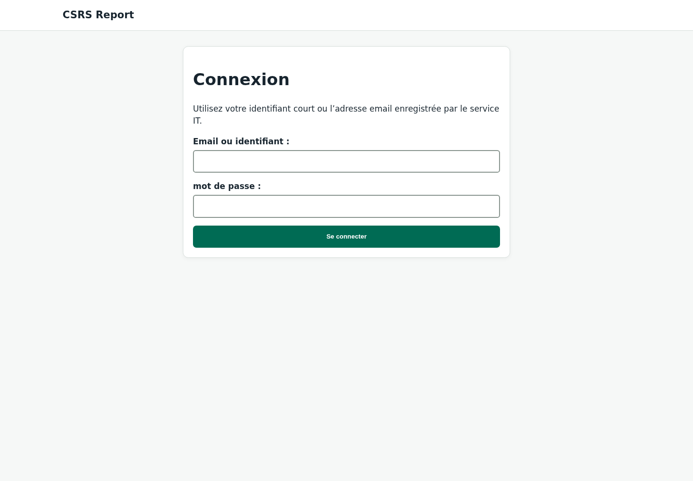

** Remplacer un mot de passe temporaire
:PROPERTIES:
:CUSTOM_ID: proc-mot-de-passe-temporaire
:END:

1. Se connecter avec le mot de passe temporaire transmis par l'administrateur IT.
2. Dans l'écran obligatoire =Choisir un nouveau mot de passe=, saisir de nouveau ce mot de passe temporaire.
3. Saisir puis confirmer un nouveau mot de passe personnel.
4. Sélectionner =Enregistrer=. Les autres fonctions deviennent accessibles uniquement après cette opération.

Le mot de passe temporaire ne doit pas être conservé après son remplacement ni transmis dans une observation, un email collectif ou un document partagé.

** Utiliser le menu sur ordinateur et téléphone
:PROPERTIES:
:CUSTOM_ID: proc-navigation
:END:

Sur ordinateur, le menu reste à gauche et peut être réduit. Sur téléphone, sélectionner le bouton =Ouvrir le menu= en haut de l'écran, choisir une rubrique, puis laisser le menu se refermer automatiquement. La rubrique courante est mise en évidence.

#+CAPTION: Menu mobile du profil feuille; les fonctions managériales ne sont pas affichées.
#+ATTR_HTML: :alt "Menu mobile ouvert pour un collaborateur sans subordonné" :width "360"
#+ATTR_LATEX: :width 0.4\linewidth :placement [H]
#+ATTR_ODT: :width 6.0
#+ATTR_ORG: :width 360
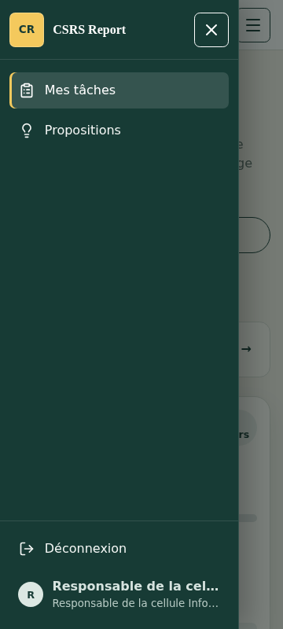

** Gérer son profil, son avatar et son cahier des charges
:PROPERTIES:
:CUSTOM_ID: proc-profil
:END:

1. Sélectionner son nom, sa fonction ou son avatar en bas du menu principal pour ouvrir =Mon profil=.
2. Modifier si nécessaire le prénom, le nom et le numéro de téléphone.
3. Pour remplacer l'icône par une photographie, saisir dans =URL de l'image d'avatar= l'adresse HTTPS directe d'une image accessible par l'application. Ne pas utiliser un lien vers une page web protégée par un mot de passe.
4. Saisir ou corriger le =Cahier des charges=, c'est-à-dire les responsabilités permanentes de l'employé et non celles d'un projet.
5. Sélectionner =Enregistrer=. Le nom et l'avatar du menu sont actualisés après l'enregistrement.
6. Dans =Mes tâches=, sélectionner =Modifier mon cahier des charges= pour revenir directement à ce formulaire de profil.

Le responsable hiérarchique peut consulter ces informations, mais seul l'employé modifie son profil courant et son cahier des charges depuis cette page.

#+CAPTION: Profil personnel avec identité, téléphone, avatar et cahier des charges.
#+ATTR_HTML: :alt "Profil personnel permettant de modifier le prénom, le nom, le téléphone, l'avatar et le cahier des charges" :width "100%"
#+ATTR_LATEX: :width 0.95\linewidth :placement [H]
#+ATTR_ODT: :width 16.0
#+ATTR_ORG: :width 1000
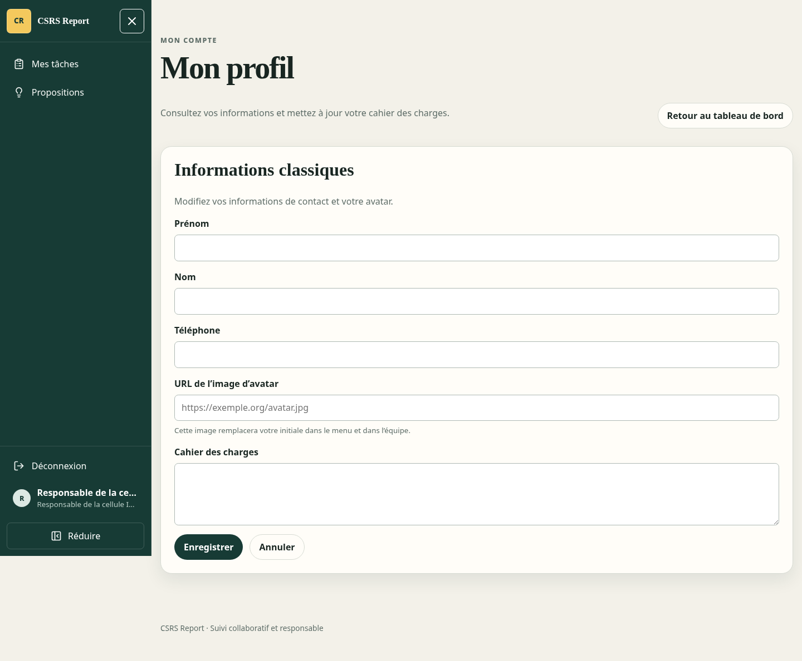

** Choisir la période et lire le tableau de bord
:PROPERTIES:
:CUSTOM_ID: proc-tableau-bord
:END:

1. Sélectionner =Mes tâches=.
2. Utiliser =Période précédente= ou =Période suivante= pour changer de semaine ou de mois.
3. Lire sur chaque carte le statut, le pourcentage, l'évolution sur la période, les dates et la charge restante.
4. Sélectionner le titre d'une tâche pour ouvrir son détail.
5. Si aucune tâche n'apparaît, contrôler d'abord la période avant de conclure qu'aucune attribution n'existe.

#+CAPTION: Tableau de bord personnel du profil feuille.
#+ATTR_HTML: :alt "Cartes de tâches du tableau de bord personnel avec progression, dates et charge" :width "100%"
#+ATTR_LATEX: :width 0.95\linewidth :placement [H]
#+ATTR_ODT: :width 16.0
#+ATTR_ORG: :width 1000
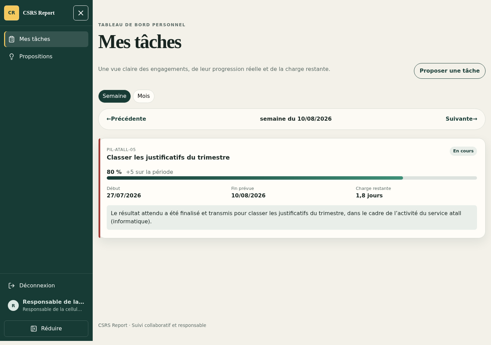

** Lire le détail et le graphique d'une tâche
:PROPERTIES:
:CUSTOM_ID: proc-lire-tache
:END:

Le haut de la page présente le code, le titre, le statut et le pourcentage. La ligne de détails distingue la date de début, la date du jour, la fin prévue, la charge initiale, la charge réalisée et la charge restante.

Le graphique place les dates sur l'axe horizontal et la progression sur l'axe vertical. Les repères identifient le début, aujourd'hui et la fin prévue. Les points pleins correspondent à des progressions réellement saisies; les points reportés prolongent la dernière valeur connue. Une zone de retard peut apparaître après la date de fin prévue.

Utiliser le bouton de légende ou la table alternative pour obtenir une explication textuelle. Au clavier, placer le focus sur le graphique puis utiliser les flèches gauche et droite pour parcourir les dates.

#+CAPTION: Détail d'une tâche avec dates, charges, graphique et conversation.
#+ATTR_HTML: :alt "Détail complet d'une tâche et graphique de progression daté" :width "100%"
#+ATTR_LATEX: :width 0.95\linewidth :placement [H]
#+ATTR_ODT: :width 16.0
#+ATTR_ORG: :width 1000
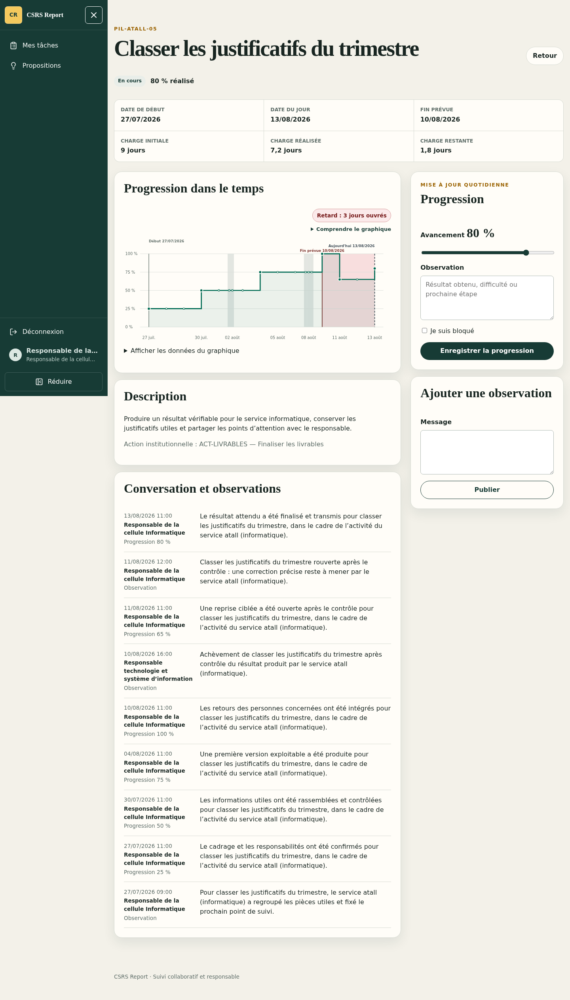

** Mettre à jour la progression
:PROPERTIES:
:CUSTOM_ID: proc-progression
:END:

1. Ouvrir la tâche selon [[#proc-tableau-bord][Choisir la période et lire le tableau de bord]].
2. Dans =Mise à jour quotidienne — Progression=, déplacer le curseur jusqu'au pourcentage atteint.
3. Saisir une observation lorsque le résultat, la difficulté ou la prochaine étape mérite d'être expliqué.
4. Cocher =Je suis bloqué= si un obstacle empêche réellement la poursuite; pour une tâche personnelle de la Direction générale, le libellé devient =Signaler un point d'attention=.
5. Sélectionner =Enregistrer la progression= et attendre le message de confirmation.

Une observation est obligatoire lorsque le pourcentage diminue ou lorsqu'un blocage est signalé. Une saisie à =100 %= demande encore une validation explicite du responsable.

** Publier une observation sans modifier le pourcentage
:PROPERTIES:
:CUSTOM_ID: proc-observation
:END:

1. Ouvrir la tâche et repérer le bloc =Ajouter une observation=.
2. Saisir un message utile et vérifiable, par exemple une décision reçue, une pièce manquante ou la prochaine échéance.
3. Sélectionner =Publier=.
4. Vérifier le nouveau message dans =Conversation et observations= avec sa date, son auteur et son type.

Une observation publiée appartient à l'historique auditable. En cas d'erreur, ne pas réécrire silencieusement l'information d'un autre utilisateur; publier une précision ou demander une correction au responsable.

#+CAPTION: Commandes de progression et d'observation d'une tâche.
#+ATTR_HTML: :alt "Formulaire de progression, observation associée et publication d'un message" :width "100%"
#+ATTR_LATEX: :width 0.95\linewidth :placement [H]
#+ATTR_ODT: :width 16.0
#+ATTR_ORG: :width 1000
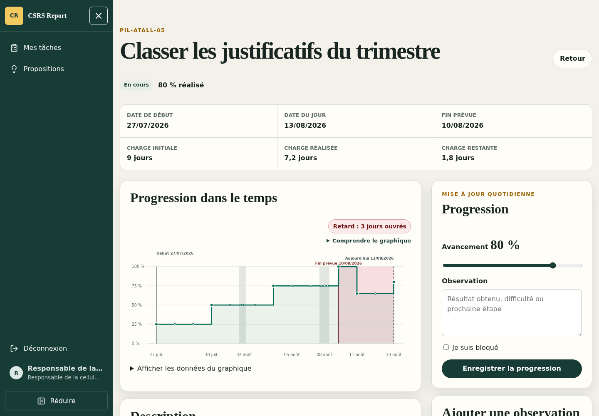

** Proposer une tâche
:PROPERTIES:
:CUSTOM_ID: proc-proposer-tache
:END:

Cette procédure convient à tout utilisateur actif, notamment au collaborateur qui ne possède pas le menu =Affecter=.

1. Sélectionner =Propositions= puis =Nouvelle proposition=, ou utiliser =Proposer une tâche= depuis le tableau de bord.
2. Saisir un nom court qui décrit le résultat attendu.
3. Décrire le livrable ou le résultat vérifiable.
4. Choisir éventuellement une action institutionnelle; ce rattachement est facultatif.
5. Saisir la date de début au format =jj/mm/aaaa=.
6. Ajuster soit la fin prévue, soit la charge estimée; le calendrier de travail synchronise l'autre valeur.
7. Dans =Charge estimée=, saisir d'abord la valeur puis choisir l'unité avec le bouton à deux états =Jours= ou =Heures=. =Jours= est sélectionné par défaut et une journée ouvrée vaut huit heures.
8. En jours, les flèches du clavier et du champ avancent par =0,25= jour; en heures, elles avancent par =0,5= heure. Une valeur saisie directement est arrondie à la précision la plus proche de l'unité choisie.
9. Sélectionner =Soumettre=.
10. Suivre la proposition dans =Mes propositions= jusqu'à sa validation ou son rejet.

#+CAPTION: Formulaire de proposition utilisé par le profil feuille.
#+ATTR_HTML: :alt "Formulaire pour proposer une tâche avec dates et charge estimée" :width "100%"
#+ATTR_LATEX: :width 0.95\linewidth :placement [H]
#+ATTR_ODT: :width 16.0
#+ATTR_ORG: :width 1000
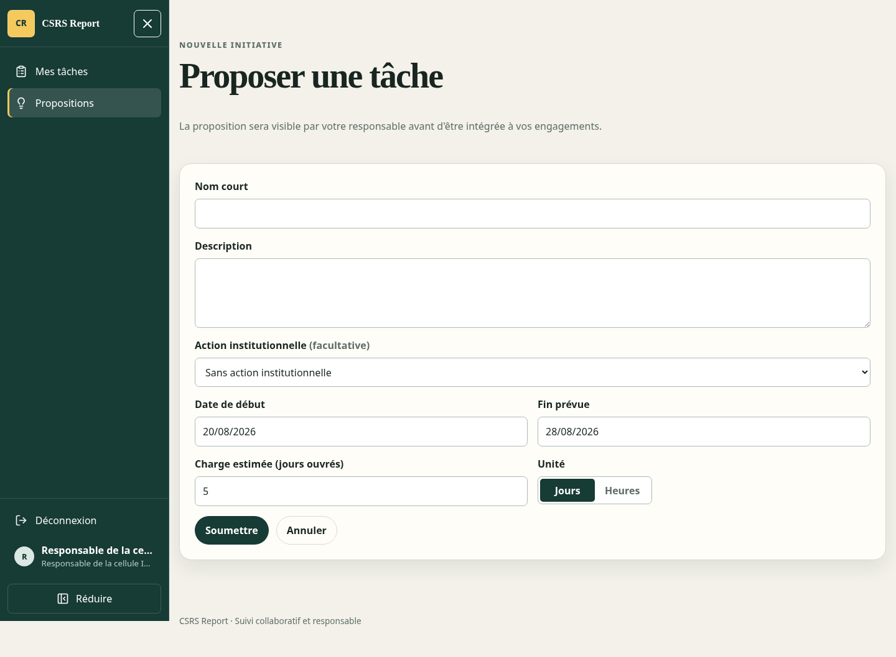

** Corriger une proposition rejetée
:PROPERTIES:
:CUSTOM_ID: proc-corriger-proposition
:END:

1. Ouvrir =Propositions= et conserver le filtre =Rejetées=.
2. Ouvrir la proposition et lire le motif du responsable.
3. Sélectionner =Corriger et resoumettre=.
4. Modifier les informations demandées puis enregistrer.
5. Resoumettre la proposition; l'historique du rejet et de la correction reste conservé.

** Créer et attribuer directement une tâche
:PROPERTIES:
:CUSTOM_ID: proc-affecter-tache
:END:

Cette procédure est réservée aux responsables qui voient le menu =Affecter=. Contrairement à une proposition, l'enregistrement crée immédiatement la tâche et son attribution.

1. Sélectionner =Affecter=.
2. Saisir le nom court et la description du résultat attendu.
3. Choisir le collaborateur dans la liste autorisée. Cette liste contient les collaborateurs directs, les personnes couvertes par une délégation active et, pour une racine organisationnelle comme =dg=, le responsable lui-même.
4. Choisir éventuellement l'action institutionnelle; elle reste facultative.
5. Saisir la date de début.
6. Définir la fin prévue ou la charge estimée. La valeur précède le bouton =Jours / Heures=; =Jours= est la valeur par défaut et le survol rappelle qu'un jour ouvré vaut huit heures. Les pas sont de =0,25= jour et =0,5= heure, y compris avec les flèches du clavier ou du champ; une saisie libre est arrondie à la précision correspondante.
7. Sélectionner =Enregistrer=.
8. Vérifier la page de détail créée, le collaborateur, le responsable et les dates.

#+CAPTION: Attribution directe d'une tâche par un responsable intermédiaire.
#+ATTR_HTML: :alt "Formulaire Affecter une tâche avec choix du collaborateur" :width "100%"
#+ATTR_LATEX: :width 0.95\linewidth :placement [H]
#+ATTR_ODT: :width 16.0
#+ATTR_ORG: :width 1000
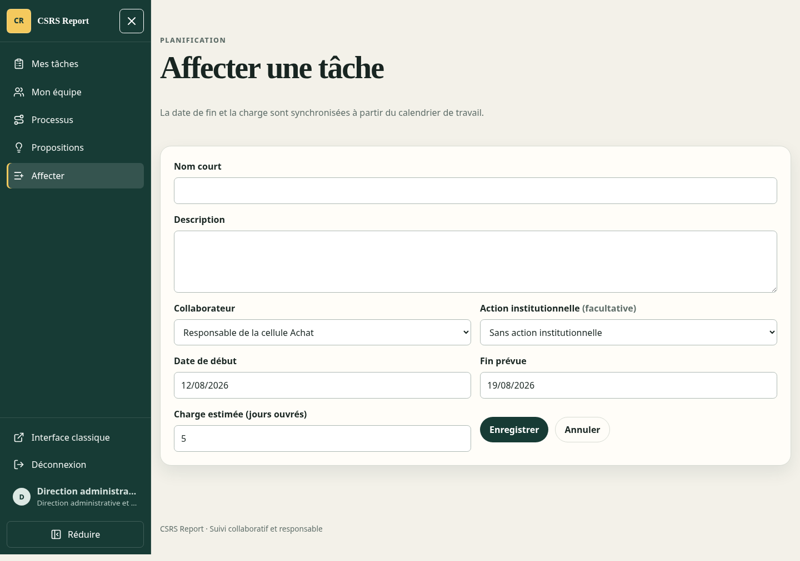

** Consulter l'équipe
:PROPERTIES:
:CUSTOM_ID: proc-equipe
:END:

1. Sélectionner =Mon équipe=.
2. Choisir la période avec les commandes communes.
3. Utiliser =Tous=, =Avec tâches= ou =Sans tâche= pour filtrer les collaborateurs.
4. Ouvrir une branche pour afficher les tâches et la synthèse du collaborateur sans quitter la page d'équipe.
5. Sélectionner uniquement le nom, la fonction ou l'avatar du collaborateur pour ouvrir son profil. Ouvrir une branche ou sélectionner le titre d'une tâche ne doit pas ouvrir ce profil.
6. Dans le profil collaborateur, consulter son identité et son cahier des charges. Le cahier des charges se trouve après la liste des tâches et reste replié par défaut.
7. Sélectionner le titre d'une tâche pour consulter uniquement le détail de cette tâche.

#+CAPTION: Synthèse d'équipe d'un responsable intermédiaire.
#+ATTR_HTML: :alt "Arbre d'équipe avec collaborateurs, tâches, progression et charge" :width "100%"
#+ATTR_LATEX: :width 0.95\linewidth :placement [H]
#+ATTR_ODT: :width 16.0
#+ATTR_ORG: :width 1000
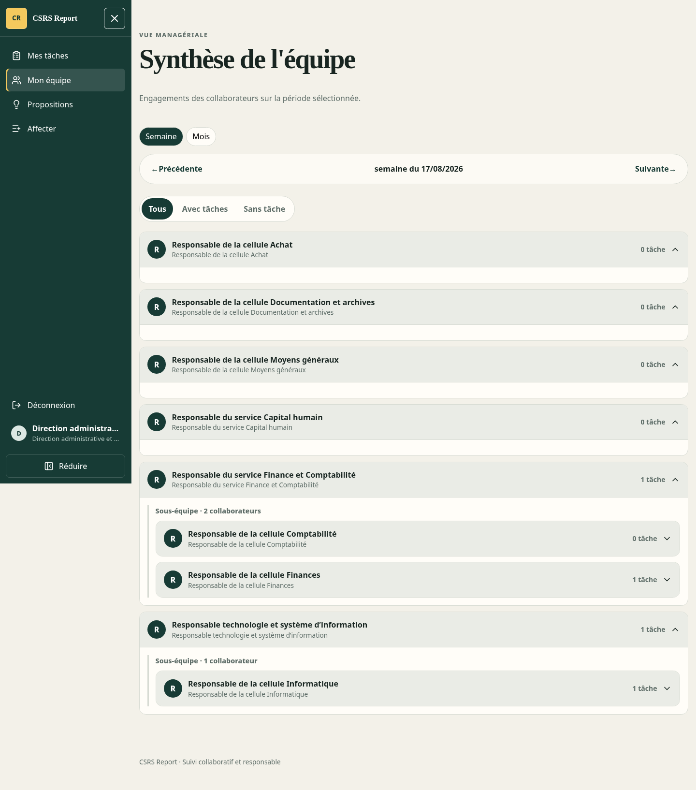

#+CAPTION: Profil d'un collaborateur consulté par son responsable avec tâches et cahier des charges replié.
#+ATTR_HTML: :alt "Profil collaborateur accessible depuis son identité dans Mon équipe" :width "100%"
#+ATTR_LATEX: :width 0.95\linewidth :placement [H]
#+ATTR_ODT: :width 16.0
#+ATTR_ORG: :width 1000
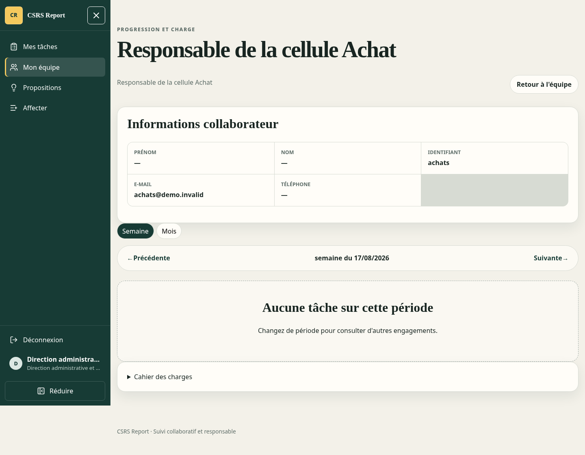

** Examiner une proposition
:PROPERTIES:
:CUSTOM_ID: proc-examiner-proposition
:END:

1. Ouvrir =Propositions=.
2. Dans =À examiner=, utiliser les filtres de statut, collaborateur et période si nécessaire.
3. Ouvrir la proposition pour contrôler sa description, ses dates et sa charge.
4. Sélectionner =Valider= pour créer la tâche et son attribution.
5. Pour refuser, saisir d'abord un motif précis puis sélectionner =Rejeter=.

#+CAPTION: Propositions à examiner par un responsable.
#+ATTR_HTML: :alt "Liste des propositions soumises avec boutons Valider et Rejeter" :width "100%"
#+ATTR_LATEX: :width 0.95\linewidth :placement [H]
#+ATTR_ODT: :width 16.0
#+ATTR_ORG: :width 1000
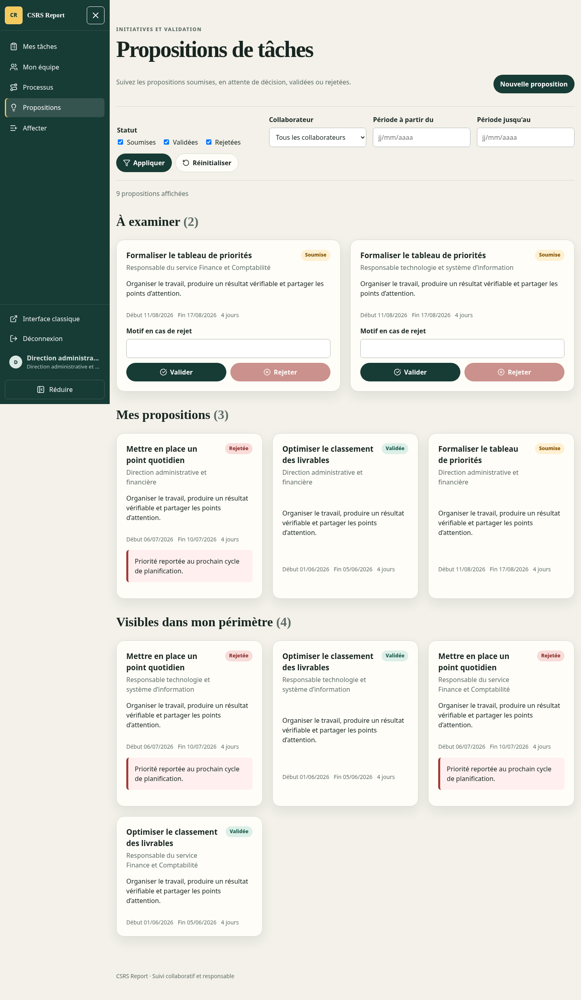

** Valider l'achèvement ou demander une reprise
:PROPERTIES:
:CUSTOM_ID: proc-valider-tache
:END:

1. Ouvrir une tâche portant le statut =À valider=.
2. Contrôler le résultat, le graphique et la conversation.
3. Sélectionner =Valider l'achèvement= si le résultat est accepté; la tâche devient =Terminée=.
4. Si un complément est nécessaire, saisir obligatoirement le motif puis sélectionner =Demander une reprise=; la tâche redevient =En cours= et le motif apparaît dans l'historique.
5. Utiliser =Clôturer avant achèvement= uniquement lorsqu'une décision réelle abandonne le solde de travail; un motif est obligatoire.

* Parcours du collaborateur en feuille

Le profil =atall= ne possède pas de collaborateur. Il travaille sur ses propres engagements sans pouvoir attribuer ou valider les tâches d'une autre personne.

1. Se connecter selon [[#proc-connexion][Se connecter et se déconnecter]].
2. Tenir à jour son identité et ses responsabilités selon [[#proc-profil][Gérer son profil, son avatar et son cahier des charges]].
3. Consulter ses engagements selon [[#proc-tableau-bord][Choisir la période et lire le tableau de bord]].
4. Lire les dates, la charge et l'historique selon [[#proc-lire-tache][Lire le détail et le graphique d'une tâche]].
5. Saisir l'avancement selon [[#proc-progression][Mettre à jour la progression]].
6. Échanger avec le responsable selon [[#proc-observation][Publier une observation sans modifier le pourcentage]].
7. Suggérer un nouvel engagement selon [[#proc-proposer-tache][Proposer une tâche]].
8. En cas de rejet, appliquer [[#proc-corriger-proposition][Corriger une proposition rejetée]].

* Parcours du responsable intermédiaire

Le profil =daf= cumule ses opérations personnelles et les responsabilités portant sur ses collaborateurs ou sur un périmètre explicitement délégué.

1. Utiliser les procédures personnelles [[#proc-profil][de profil]], [[#proc-tableau-bord][du tableau de bord]], [[#proc-progression][de progression]], [[#proc-observation][d'observation]] et [[#proc-proposer-tache][de proposition]].
2. Surveiller les engagements avec [[#proc-equipe][Consulter l'équipe]].
3. Créer et attribuer un engagement avec [[#proc-affecter-tache][Créer et attribuer directement une tâche]].
4. Traiter les initiatives avec [[#proc-examiner-proposition][Examiner une proposition]].
5. Décider du travail à =100 %= avec [[#proc-valider-tache][Valider l'achèvement ou demander une reprise]].

Un responsable intermédiaire peut consulter une descendance plus large, mais les décisions quotidiennes restent attachées au responsable principal ou à une délégation de gestion active.

* Parcours de la Direction générale

Le profil =dg= se trouve à la racine de l'organigramme. Son tableau de bord contient ses tâches personnelles, tandis que =Mon équipe= ouvre le périmètre de direction.

#+CAPTION: Tableau de bord personnel de la Direction générale.
#+ATTR_HTML: :alt "Tableau de bord de la Direction générale avec tâches personnelles" :width "100%"
#+ATTR_LATEX: :width 0.95\linewidth :placement [H]
#+ATTR_ODT: :width 16.0
#+ATTR_ORG: :width 1000
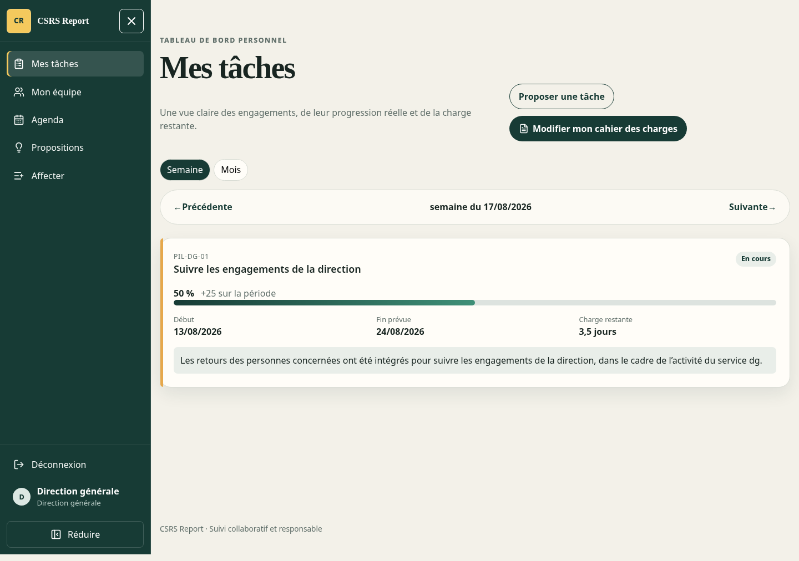

** S'attribuer une tâche personnelle

1. Ouvrir =Affecter= et appliquer [[#proc-affecter-tache][Créer et attribuer directement une tâche]].
2. Choisir =Direction générale= dans =Collaborateur=.
3. Enregistrer la tâche et mettre ensuite sa progression à jour comme tout autre collaborateur.
4. À =100 %=, utiliser la décision explicite de clôture personnelle; une tâche personnelle ne se termine pas automatiquement.

#+CAPTION: Auto-attribution d'une tâche par la Direction générale.
#+ATTR_HTML: :alt "Formulaire Affecter avec la Direction générale disponible comme collaborateur" :width "100%"
#+ATTR_LATEX: :width 0.95\linewidth :placement [H]
#+ATTR_ODT: :width 16.0
#+ATTR_ORG: :width 1000
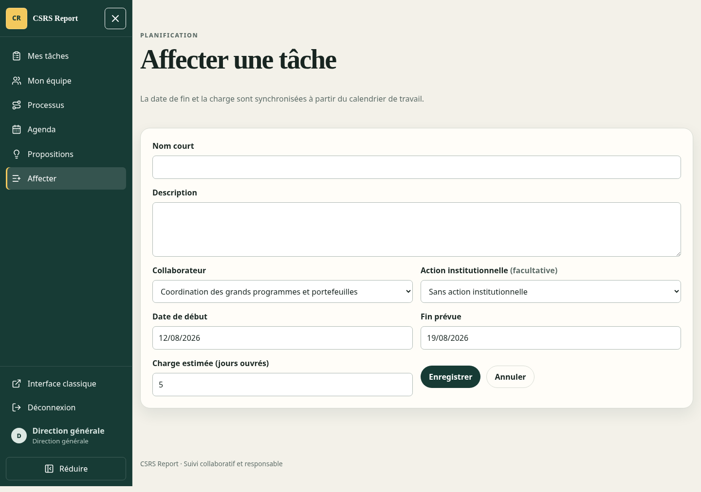

** Superviser le périmètre de direction

Appliquer [[#proc-equipe][Consulter l'équipe]] puis ouvrir seulement les directions et sous-équipes nécessaires. Utiliser les graphiques pour repérer la progression, la charge restante, les blocages et les retards avant d'ouvrir le détail d'une tâche.

#+CAPTION: Périmètre d'équipe visible par la Direction générale.
#+ATTR_HTML: :alt "Synthèse hiérarchique des directions et collaborateurs de la Direction générale" :width "100%"
#+ATTR_LATEX: :width 0.95\linewidth :placement [H]
#+ATTR_ODT: :width 16.0
#+ATTR_ORG: :width 1000
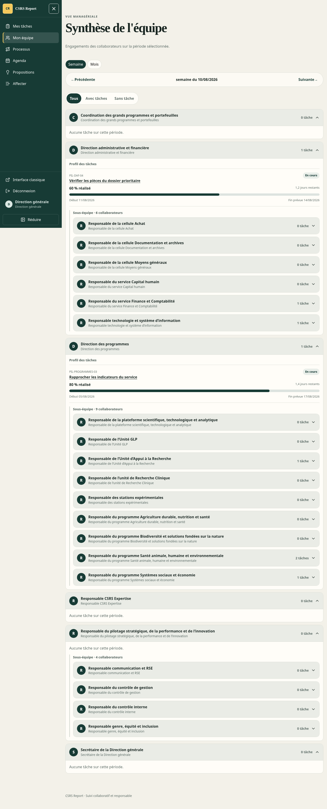

* Annexe — Support de la réunion de direction

** Déclarer les absences et missions dans l'agenda
:PROPERTIES:
:CUSTOM_ID: proc-absences
:END:

Le compte RH ouvre =Absences et missions=, choisit la semaine, l'agent, la nature, les dates et une observation facultative, puis sélectionne =Ajouter=. Une correction modifie l'entrée auditée; une annulation exige un motif.

#+CAPTION: Saisie RH des congés, absences et missions.
#+ATTR_HTML: :alt "Écran RH pour déclarer une indisponibilité d'un agent" :width "100%"
#+ATTR_LATEX: :width 0.95\linewidth :placement [H]
#+ATTR_ODT: :width 16.0
#+ATTR_ORG: :width 1000
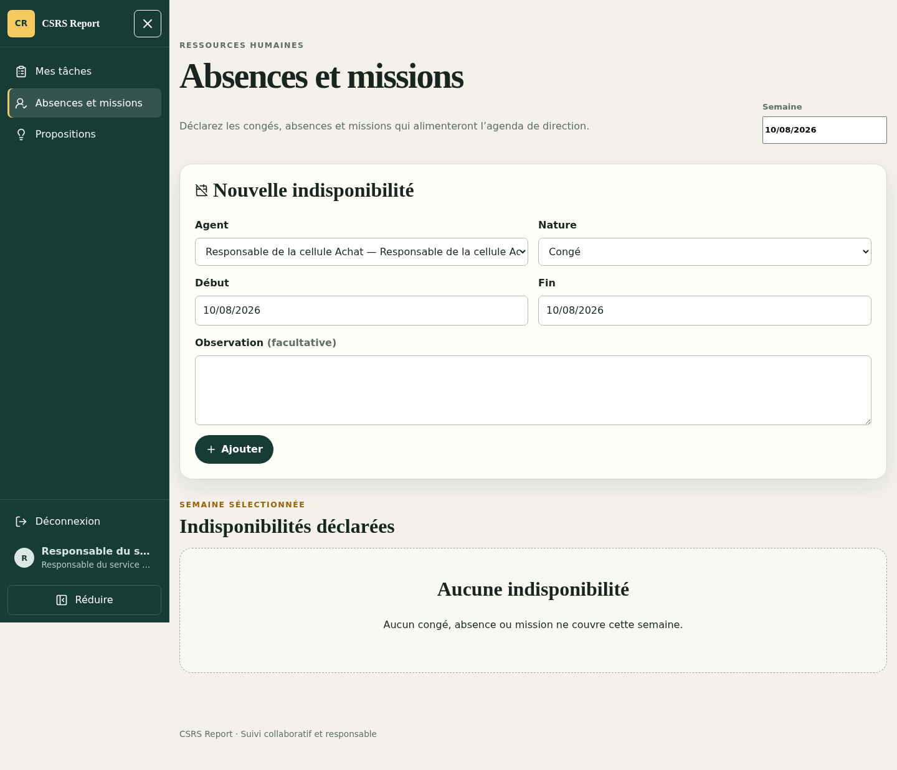

** Préparer et générer le fichier de support
:PROPERTIES:
:CUSTOM_ID: proc-generer-agenda
:END:

Cette procédure est réalisée par le secrétariat de la Direction générale. Elle produit séparément un PDF pour la Direction des programmes et un PDF pour la Direction administrative.

1. Ouvrir =Agenda=.
2. Sélectionner le bouton qui affiche la période courante pour ouvrir un calendrier unique. Cliquer d'abord sur la date de début, puis sur la date de fin de la plage mise en évidence; le premier clic affiche une instruction et non une erreur. Sur ordinateur, deux mois sont visibles côte à côte et sur téléphone un seul mois est affiché. Sélectionner =Appliquer= seulement lorsque la période est correcte; =Annuler= ferme le panneau sans modifier l'agenda. =Semaine prochaine= applique directement le lundi au dimanche proposé par défaut. Une période ne peut pas dépasser 31 jours inclusifs.
3. Dans =Visiteurs=, enregistrer chaque arrivée et marquer le départ lorsqu'il survient. Les noms sont facultatifs, mais le nombre déclaré doit être exact.
4. Dans =Événements majeurs=, saisir les faits à placer en tête des deux rapports. S'il n'existe aucun événement particulier, saisir =RAS=.
5. Dans =Direction de l'agenda=, choisir =Direction des programmes= ou =Direction administrative=. Ce sélecteur actualise l'aperçu affiché et détermine le PDF produit; contrôler ensuite les arrivées, départs, congés, absences, missions, services avec activité, tâches, pourcentages et observations. Pendant une mise à jour, le dernier agenda reste visible. Si le chargement échoue, sélectionner =Réessayer= dans l'avertissement local; aucune boîte de dialogue ne bloque le reste de la page.
6. Vérifier l'avertissement =Personnes non classées=. Les tâches de ces personnes apparaissent volontairement dans les deux agendas jusqu'à leur classement par l'administrateur IT. Les tâches du DG sont explicitement exclues des deux agendas et ne déclenchent pas cet avertissement.
7. Si le travail doit être repris plus tard, sélectionner =Enregistrer le brouillon=.
8. Lorsque l'aperçu est correct, sélectionner l'unique bouton =Générer le PDF=. Changer ensuite la direction dans le sélecteur pour préparer l'autre agenda; les deux générations sont indépendantes et peuvent avoir des numéros de version différents.
9. Attendre le message confirmant la direction archivée.
10. Dans =Versions archivées=, contrôler la période, la direction et le numéro de version, puis sélectionner =Ouvrir le PDF= pour télécharger ou imprimer le fichier.

#+CAPTION: Préparation par le secrétariat avec le calendrier unique de sélection de période.
#+ATTR_HTML: :alt "Calendrier unique ouvert pour choisir le début et la fin de la période d'un agenda" :width "100%"
#+ATTR_LATEX: :width 0.95\linewidth :placement [H]
#+ATTR_ODT: :width 16.0
#+ATTR_ORG: :width 1000
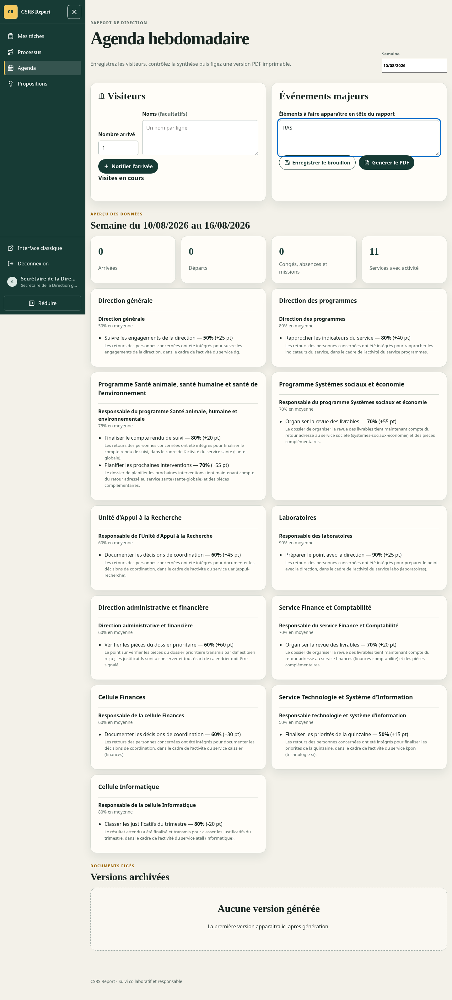

Chaque génération crée une nouvelle version figée et auditable pour une seule direction. Une correction ultérieure ne remplace pas l'ancienne version : enregistrer le brouillon partagé puis générer une version supplémentaire de la direction concernée.

#+CAPTION: Confirmation et version PDF archivée après génération.
#+ATTR_HTML: :alt "Message de génération réussie et lien vers la version PDF archivée" :width "100%"
#+ATTR_LATEX: :width 0.95\linewidth :placement [H]
#+ATTR_ODT: :width 16.0
#+ATTR_ORG: :width 1000
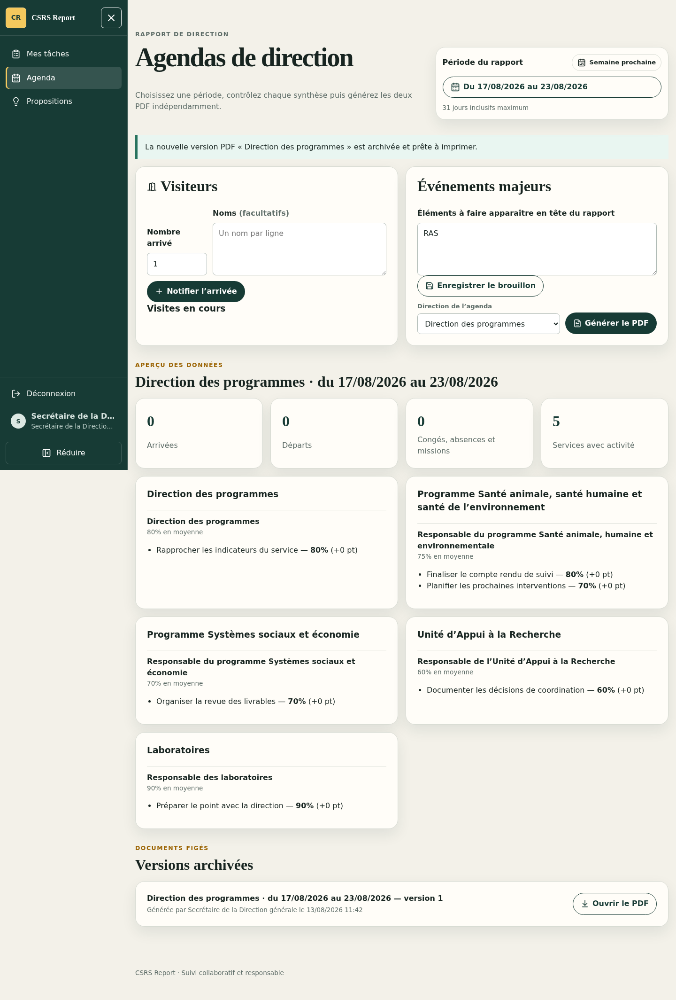

** Consulter et réimprimer comme Direction générale
:PROPERTIES:
:CUSTOM_ID: proc-consulter-agenda
:END:

1. Se connecter comme Direction générale et ouvrir =Agenda=.
2. Repérer la période, la direction et le numéro de version attendus. Les anciens agendas globaux restent identifiés comme historiques.
3. Sélectionner =Ouvrir le PDF= pour consulter, télécharger ou réimprimer le support.
4. Demander au secrétariat de produire une nouvelle version si une correction est nécessaire; la Direction générale consulte les archives en lecture seule.

#+CAPTION: Agendas archivés consultables par la Direction générale.
#+ATTR_HTML: :alt "Liste en lecture seule des versions d'agenda accessibles à la Direction générale" :width "100%"
#+ATTR_LATEX: :width 0.95\linewidth :placement [H]
#+ATTR_ODT: :width 16.0
#+ATTR_ORG: :width 1000
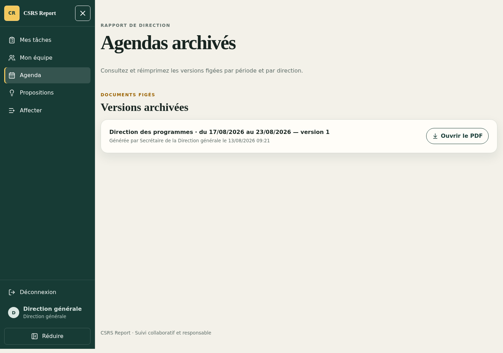

* Annexe — Administration de l'organigramme

Cette annexe concerne uniquement l'administrateur IT =dev=. Les autorisations restent imposées côté serveur.

** Ajouter une personne dans une structure existante
:PROPERTIES:
:CUSTOM_ID: proc-ajouter-personne
:END:

1. Dans l'interface React, ouvrir =Utilisateurs= puis sélectionner =Ajouter une personne=.
2. Saisir l'email institutionnel, l'identifiant court facultatif, le prénom, le nom, la fonction et le téléphone facultatif.
3. Choisir une seule =Direction de l'agenda= : =Direction des programmes= ou =Direction administrative=. Laisser vide uniquement si le classement officiel n'est pas encore connu; les tâches de la personne apparaîtront alors dans les deux agendas avec un avertissement.
4. Conserver =Inclure dans les agendas de direction= coché. Le décocher uniquement pour une exclusion explicite validée, comme celle du DG; la personne et ses tâches seront alors absentes des deux agendas.
5. Dans =Unités actuelles=, déplacer l'unité d'accueil et les éventuelles unités secondaires vers les unités choisies.
6. Choisir une seule =Unité principale=.
7. Choisir le =Responsable principal=; le laisser vide uniquement pour une véritable racine de l'organigramme.
8. Saisir la =Date d'effet= au format =jj/mm/aaaa=.
9. Enregistrer puis rouvrir la fiche afin de contrôler les valeurs.
10. Dans =Accès au compte=, sélectionner =Envoyer l'activation= après vérification de l'adresse.
11. Se connecter comme responsable et contrôler la présence de la personne dans =Mon équipe= à la date d'effet.

Le compte est créé sans mot de passe partagé. Les anciennes appartenances et lignes hiérarchiques sont clôturées et conservées dans l'historique au lieu d'être supprimées.

#+CAPTION: Fiche historique de l'administration avancée, conservée comme recours pour les droits techniques.
#+ATTR_HTML: :alt "Administration avancée d'un utilisateur avec unités, unité principale, responsable et date d'effet" :width "100%"
#+ATTR_LATEX: :width 0.95\linewidth :placement [H]
#+ATTR_ODT: :width 16.0
#+ATTR_ORG: :width 1000
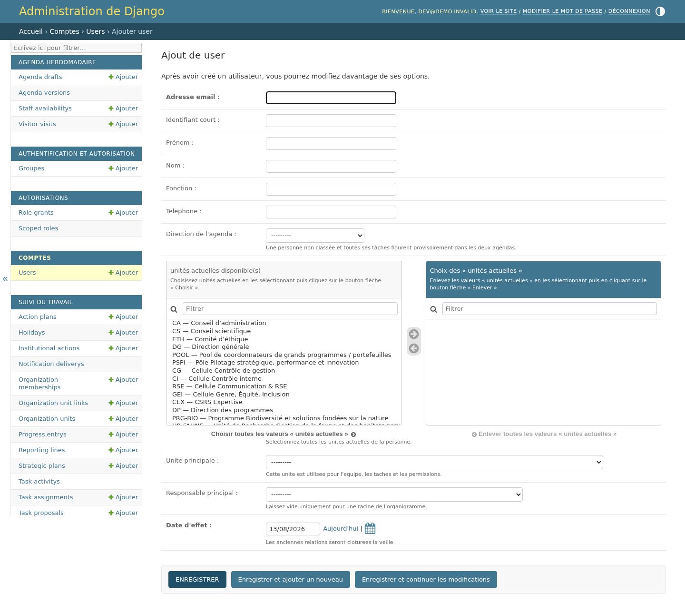

** Définir les collaborateurs directs
:PROPERTIES:
:CUSTOM_ID: proc-collaborateurs-directs
:END:

1. Ouvrir =Utilisateurs= puis la fiche du responsable.
2. Dans =Collaborateurs directs=, filtrer les personnes disponibles et déplacer les personnes concernées vers =Sélectionnés=.
3. Pour retirer une personne, sélectionner =Retirer= puis choisir son nouveau responsable principal. L'application refuse de laisser un collaborateur sans responsable.
4. Vérifier la date d'effet et sélectionner =Enregistrer l'équipe=.
5. Contrôler le résultat dans =Mon équipe=. Les tâches actives suivent automatiquement le nouveau responsable.

Cette section gère uniquement les responsables principaux. Utiliser =Administration avancée= pour un responsable secondaire; celui-ci peut suivre et commenter, mais ne peut pas affecter, modifier, valider ou clore les tâches à la place du responsable principal.

** Réinitialiser ou désactiver un compte
:PROPERTIES:
:CUSTOM_ID: proc-acces-compte
:END:

1. Ouvrir =Utilisateurs= puis la fiche de la personne.
2. Pour réinitialiser l'accès, sélectionner =Réinitialiser le mot de passe=, confirmer puis copier immédiatement le mot de passe temporaire affiché une seule fois.
3. Transmettre ce mot de passe par un canal sûr. À sa prochaine connexion, la personne suit [[#proc-mot-de-passe-temporaire][Remplacer un mot de passe temporaire]].
4. Pour retirer l'accès, sélectionner =Désactiver=. Le compte, les tâches et l'historique sont conservés.
5. Utiliser =Réactiver= pour restaurer ultérieurement l'accès.

** Créer ou rattacher une unité
:PROPERTIES:
:CUSTOM_ID: proc-ajouter-unite
:END:

1. Ouvrir =Unités d'organisation= puis =Ajouter=.
2. Saisir un code stable et unique, un nom court, un nom long, le type, l'ordre d'affichage et conserver l'unité active.
3. Choisir l'=Unité supérieure= pour placer la nouvelle unité sous une structure existante.
4. Utiliser =Unités directement rattachées= lorsqu'une nouvelle unité doit devenir le parent de plusieurs unités existantes.
5. Enregistrer puis rouvrir la fiche pour contrôler le parent et les enfants.

Une unité subordonnée possède un seul parent. L'application refuse un second parent et toute boucle hiérarchique.

#+CAPTION: Fiche de création ou de rattachement d'une unité.
#+ATTR_HTML: :alt "Administration d'une unité avec unité supérieure et unités directement rattachées" :width "100%"
#+ATTR_LATEX: :width 0.95\linewidth :placement [H]
#+ATTR_ODT: :width 16.0
#+ATTR_ORG: :width 1000
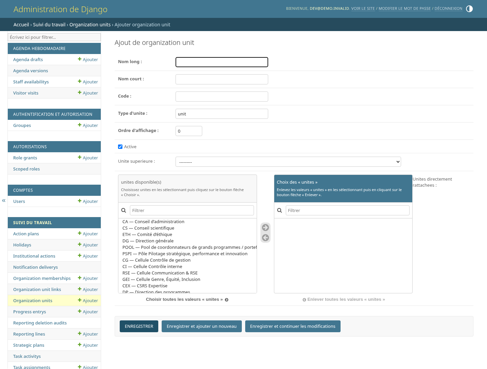

** Accorder ou révoquer une délégation
:PROPERTIES:
:CUSTOM_ID: proc-delegation
:END:

1. Ouvrir =Attributions de rôles=.
2. Choisir l'utilisateur, le rôle, l'unité, la portée, les dates et saisir un motif.
3. Utiliser =Ce service uniquement= pour une portée exacte ou =Ce service et ses sous-services= pour une portée récursive.
4. Enregistrer puis vérifier l'état actif, futur ou expiré.
5. Pour retirer les droits, révoquer la délégation avec un auteur et un motif; ne pas supprimer la ligne auditée.

Les groupes Django gèrent les permissions techniques globales. Ils ne remplacent ni l'appartenance à une unité, ni le responsable principal, ni une délégation métier datée.

#+CAPTION: Liste auditée des délégations de rôles.
#+ATTR_HTML: :alt "Administration des attributions de rôles avec unité, portée, dates et état" :width "100%"
#+ATTR_LATEX: :width 0.95\linewidth :placement [H]
#+ATTR_ODT: :width 16.0
#+ATTR_ORG: :width 1000
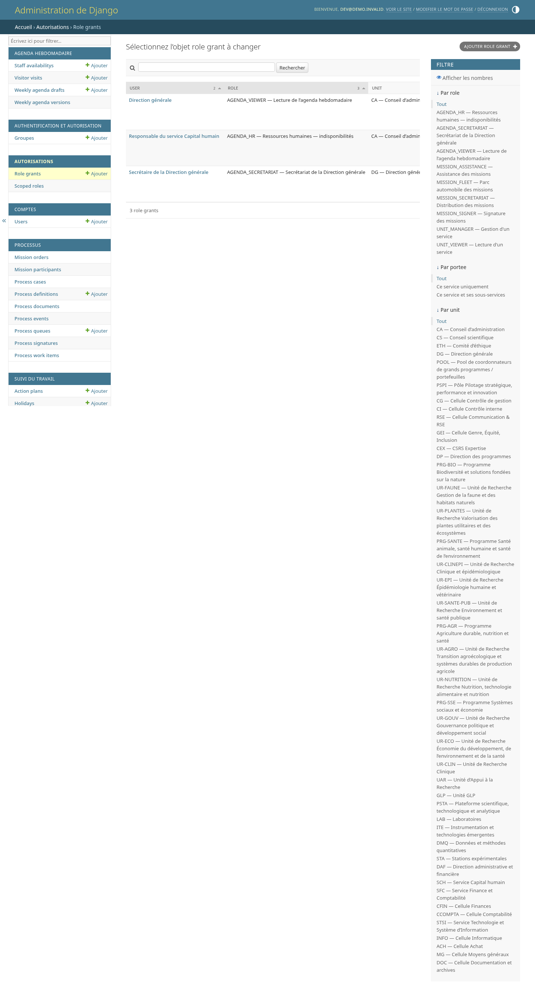

* Annexe — Déployer depuis dev

Cette annexe concerne l'opérateur technique. Le chemin normal ne consiste pas à lancer un script depuis le checkout =dev=.

1. Intégrer la branche de fonctionnalité dans =dev= par pull request.
2. Créer une pull request GitHub de =dev= vers =preprod=.
3. Attendre les contrôles =Python=, =Frontend=, =Playwright=, =Package= et =Promotion policy=.
4. Merger la pull request puis approuver l'environnement GitHub =preprod=.
5. Le job =Deploy preproduction= de =.github/workflows/ci.yml= appelle automatiquement le wrapper SSH restreint. Ce wrapper sauvegarde, vérifie le SHA, avance le checkout déployé, puis exécute =scripts/deploy_preprod.sh=.
6. Contrôler dans GitHub Actions que le job est vert et que la révision de l'image correspond au SHA de =preprod=.

=scripts/deploy_preprod.sh= ne doit pas être exécuté directement depuis =dev=: il construit le checkout courant mais n'effectue ni la promotion GitHub, ni la sauvegarde préalable, ni la validation du SHA distant. En reprise exceptionnelle, un sudoer utilise sur le serveur la commande protégée suivante avec le SHA GitHub complet de =preprod= :

#+begin_src bash
sudo /usr/local/sbin/csrs-report-preprod-deploy-root <SHA_PREPROD_COMPLET>
#+end_src

* Résoudre les difficultés courantes

#+ATTR_LATEX: :align p{0.28\linewidth}p{0.65\linewidth}
| Situation | Contrôle et action |
|-----------+--------------------|
| Le menu =Affecter= ou =Mon équipe= est absent | Vérifier la hiérarchie et les délégations avec l'administrateur; masquer un menu reflète une permission serveur. |
| Une tâche attendue n'apparaît pas | Revenir à =Mes tâches= et contrôler la semaine ou le mois sélectionné. |
| Une baisse de progression ne s'enregistre pas | Saisir l'observation obligatoire expliquant la reprise. |
| Une écriture annonce que la ressource a changé | Recharger la page, relire les nouvelles données puis recommencer sans écraser le travail récent. |
| Une proposition est rejetée | Lire le motif et appliquer [[#proc-corriger-proposition][Corriger une proposition rejetée]]. |
| L'avatar ne s'affiche pas | Vérifier que l'adresse saisie est une URL HTTPS directe vers une image accessible sans authentification. |
| Le cahier des charges n'apparaît pas dans =Mes tâches= | Sélectionner =Modifier mon cahier des charges= pour ouvrir le formulaire du profil; la section repliée après les tâches concerne la consultation d'un collaborateur par son responsable. |
| Le PDF de réunion ne se génère pas | Vérifier la période et la direction, saisir les événements majeurs ou =RAS=, puis réessayer; transmettre le message d'erreur à l'administrateur si l'échec persiste. |
| Une personne n'apparaît pas dans l'équipe | Vérifier son unité principale, son responsable principal, la date d'effet et le filtre =Tous=. |

* Régénérer les captures                                              :noexport:

Les captures sont produites contre un backend Django réel mais isolé. Le script crée une base SQLite temporaire, charge les comptes fictifs, démarre Django et Vite uniquement sur =127.0.0.1=, génère une version PDF dans un stockage temporaire, puis supprime toutes les données d'exécution.

Avec Node 24, le virtualenv =csrs= et les dépendances installées :

#+begin_src bash
cd /home/jil/csrs_report
pyenv activate csrs
cd frontend
npm ci
cd ..
./scripts/capture_manual.sh
#+end_src

Le script demande deux mots de passe temporaires distincts sans les afficher. Il refuse une cible autre que =localhost= ou =127.0.0.1=. Les images résultantes sont placées sous =docs/manual/screenshots/= et doivent être relues avant publication.

* Exporter le manuel                                                  :noexport:

Ouvrir =docs/MANUAL.org= dans Emacs puis utiliser les commandes Org classiques :

- =C-c C-e l p= pour produire =docs/MANUAL.pdf= avec LaTeX.
- =C-c C-e o o= pour produire puis ouvrir =docs/MANUAL.odt=.

Les liens d'images sont relatifs au fichier Org; l'export fonctionne donc indépendamment du répertoire depuis lequel Emacs a été lancé.
