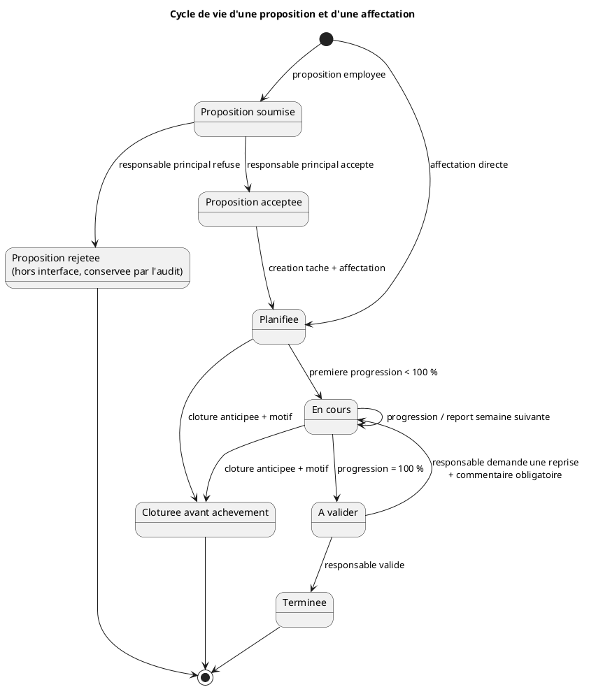

#+PROPERTY: header-args:plantuml :exports both :results file graphics :cmdline -charset UTF-8

#+begin_src plantuml :file  task-lifecycle.png 

@startuml
title Cycle de vie d'une proposition et d'une affectation

state "Proposition soumise" as submitted
state "Proposition acceptee" as accepted
state "Proposition rejetee\n(hors interface, conservee par l'audit)" as rejected
state "Planifiee" as planned
state "En cours" as active
state "A valider" as awaiting
state "Terminee" as completed
state "Cloturee avant achevement" as early

[*] --> submitted : proposition employee
submitted --> accepted : responsable principal accepte
submitted --> rejected : responsable principal refuse
accepted --> planned : creation tache + affectation
[*] --> planned : affectation directe
planned --> active : premiere progression < 100 %
active --> active : progression / report semaine suivante
active --> awaiting : progression = 100 %
awaiting --> completed : responsable valide
awaiting --> active : responsable demande une reprise\n+ commentaire obligatoire
planned --> early : cloture anticipee + motif
active --> early : cloture anticipee + motif
completed --> [*]
early --> [*]
rejected --> [*]
@enduml
#+END_SRC

#+RESULTS:

